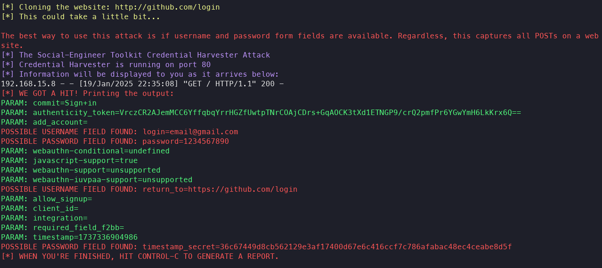

# Setoolkit Learning

### Tools
- [setoolkit](https://github.com/trustedsec/social-engineer-toolkit)

### Steps

- 1: ``` sudo setoolkit ```
- 2: ``` Social-Engineering Attacks ```
- 3: ``` Web Site Attack Vectors ```
- 4: ```Credential Harvester Attack Method ```
- 5: ``` Site Cloner ```
- 6: Paste the site's URL to clone, e.g., http://www.facebook.com, http://github.com/login

### Result


